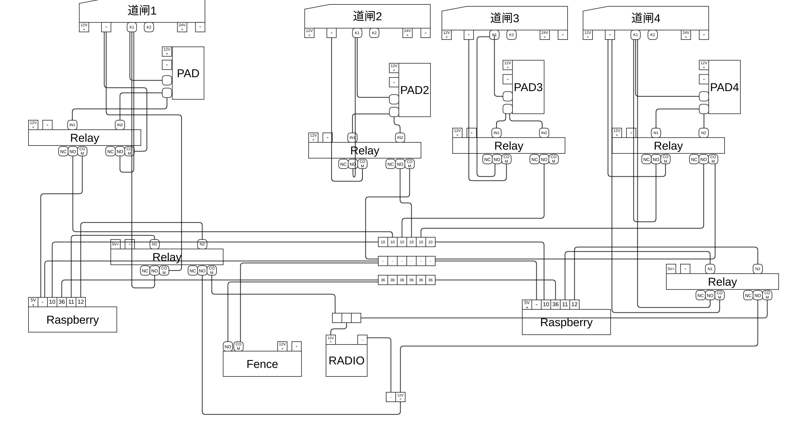

raspberry-swith
====================
### 安装操作系统
```bash
sudo dd if=/TOOLS/TOOLS/Linux/ISO/2018-04-18-raspbian-stretch-lite.img  of=/dev/mmcblk0 bs=4M

```

### 运行环境

    每个道闸出入口有两个pad，但是只需要配备一个树莓派，该树莓派接两路pad的输出。
    多个道闸组使用一个红外栅栏；一个红外栅栏的输出接到多个树莓派。
    
### 环境初始化

* 配置wifi
```
sudo nano /etc/wpa_supplicant/wpa_supplicant.conf 
ctrl_interface=DIR=/var/run/wpa_supplicant GROUP=netdev
update_config=1
network={
	ssid="Meeting"
	psk="qwer1234"
}

```
* 安装软件
```bash
    sudo apt install vim python-requests lsof telnet git
```
* 配置内网IP地址

```bash
    add code in /etc/network/interface
auto eth0
iface eth0 inet static
	address 192.168.24.237
	gateway 192.168.24.1
	netmask	255.255.255.0

```
### 接线说明
    gnd5 为树莓派的GND
    gnd12 为道闸控制版的GND
####红外栅栏
    红外阑珊告警常闭[no]接树莓派pi36
    com 接树莓派gnd5
    代码中给36针挂高电平，当联通后，返回0
####道闸
    道闸k1为开关，当K1和gnd12联通的时候，道闸开启
####PAD
    pad有一开关口，输入为K1，输出接继电器R1的IN口和R2的IN
    pad开启的时候，R1和R2同时收到开关信号
####继电器模组1
    使用两组继电器模块，控制电压为12V
    继电器输入电压接道闸的V12
#####继电器R1
    R1的NO口接K1
    com接gnd12
#####继电器R2
    R2的NO口接树莓派的pin10
    pin10拉高电平
    com接gnd5
    当pad联通的时候，pi收到0
####继电器模组2
    用于树莓派输出信号
    输入电压为12V
    接树莓派gnd5
#####继电器R3
    R3的IN接树莓派的pin11
    NO接道闸K1
    com接GND12
#####继电器R4
    R3的IN接树莓派的pin12
    NO接道闸12V
    com接GND12


###部署说明

1. 运行环境

    src下的所有文件cp到树莓派上
    或者执行
    $python deploy/deploy-to-rpi.py

2. 启动命令    

```
    $python /home/pi/raspberry-switch/main.py 
```
3. 自启动
```bash
    vi /etc/rc.local
    su - pi -c "python /home/pi/raspberry-switch/main.py &"
```